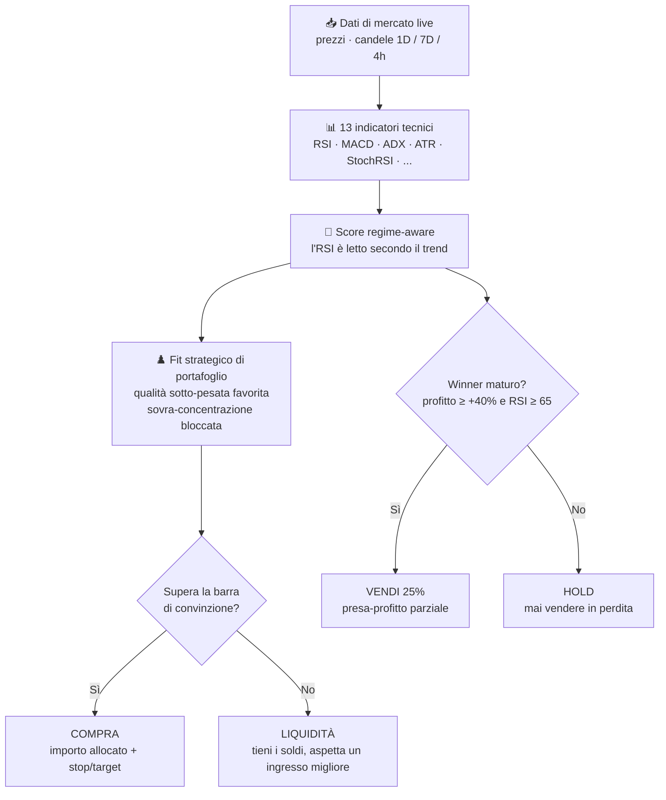

<div align="center">

# 📊 Crypto Assistant — Marco Ferretti

### Il tuo consulente crypto quantitativo, in italiano

Analisi tecnica automatica del portafoglio con **decisioni 100% oggettive** e disciplina di acquisto/vendita.<br/>
Tre canali, una sola logica: **CLI locale** · **Bot Telegram** · **Report automatici GitHub Actions**.

<br/>


</div>

---

> **13 indicatori su 3 timeframe → score regime-aware → strategia di portafoglio → decisione deterministica.**
> L'AI scrive solo il contesto: non può inventare segnali, asset o importi. Se non c'è un'occasione forte, la risposta giusta è *"tieni i soldi liquidi"*.

---

## ✨ Caratteristiche

- 📡 **Dati live** da **Crypto.com Exchange API** (fallback CoinGecko), con retry automatico sugli errori 5xx
- 🕒 **Analisi multi-timeframe** (settimanale + giornaliero + 4h) con **13 fattori tecnici**: RSI(14), SMA50/200, MACD, Bande di Bollinger, **ADX/DMI**, **StochRSI**, **ATR**, **divergenze prezzo/RSI**, **forza relativa vs BTC**, Volume/OBV, Supporti/Resistenze, Fear & Greed, Community Sentiment
- 🧭 **Scoring regime-aware**: l'RSI è letto secondo il regime di mercato rilevato dall'ADX — l'RSI alto in un trend rialzista non è più penalizzato come "vendita"
- 🔒 **Decisione 100% deterministica in codice**: l'AI non può inventare segnali, asset o importi — produce solo una nota di contesto validata (scartata se contiene azioni o importi)
- ♟️ **Layer strategico di portafoglio** (`data/strategy.json`): ogni euro va dove rende di più aggiustato per il rischio — favorisce la qualità sotto-pesata (BTC/ETH), **blocca la sovra-concentrazione** su singole altcoin (tetto configurabile)
- 🎚️ **Postura adattiva**: base conservativa con tilt automatico verso *balanced* solo quando i dati lo giustificano (alt ad alta convinzione o altseason oggettiva)
- 💤 **La liquidità è una scelta**: se nessuna occasione supera la barra di convinzione, il motore **non compra** e lo dichiara — nessuna alt o stablecoin forzata
- 💰 **Vendita disciplinata**: solo presa-profitto **parziale** su winner maturi (P&L ≥ +40% e RSI ≥ 65) — sempre una frazione, **mai in perdita, mai tutta la posizione**
- 🎯 **Livelli operativi**: ogni acquisto esce con stop-loss e target concreti calcolati da ATR
- 👁️ **Watchlist**: analisi su asset non in portafoglio — solo opportunità di acquisto (mai vendita)
- 🔁 **Coerenza garantita**: locale e Telegram usano la stessa funzione — raccomandazione identica su ogni canale

---

## 🔀 Come funziona



---

## 🧠 Logica dei segnali

La decisione è **calcolata al 100% in codice**, non dall'AI. Il flusso è: *analisi ampia → score tattico regime-aware → fit strategico di portafoglio → allocazione del budget*.

### 1 · Score tattico

Lo score somma 13 fattori. L'**RSI è regime-aware**: in un trend rialzista forte (ADX ≥ 25, +DI > −DI) l'RSI alto non è penalizzato ma letto come forza; in un trend ribassista l'RSI basso non è un segnale d'acquisto (non si compra "il coltello che cade"); in mercato laterale vale la mean-reversion classica.

| Fattore | Range punti |
|---------|:-----------:|
| RSI(14) regime-aware | `−30 / +25` |
| Trend SMA50/200 | `−25 / +25` |
| MACD | `−20 / +20` |
| Bande di Bollinger | `−15 / +15` |
| Divergenza prezzo/RSI | `−12 / +12` |
| Volume + OBV | `−10 / +10` |
| Fear & Greed Index | `−10 / +10` |
| StochRSI | `−8 / +8` |
| Forza relativa vs BTC (30gg) | `−8 / +8` |
| Support/Resistance | `−8 / +8` |
| Multi-timeframe (7D/1D/4h) | `−8 / +8` |
| ADX/DMI (conferma trend) | `−5 / +5` |
| Community Sentiment | `−5 / +5` |

### 2 · Fit strategico di portafoglio

Lo score tattico viene moltiplicato per un **fit strategico** che riflette la costruzione del portafoglio (parametri in `data/strategy.json`):

- **Core (BTC/ETH)** → boost se sotto-pesato rispetto al target, taglio se sopra-pesato.
- **Altcoin** → acquisto **bloccato** se la posizione supera il tetto per singolo asset (anti sovra-concentrazione); altrimenti fit proporzionale allo spazio residuo + momentum (forza relativa vs BTC).
- `priorità = score tattico × fit strategico`

### 3 · Decisione e disciplina

- 🟢 **Acquisto** → solo se lo score supera la **barra di convinzione** (postura prudente). Budget indirizzato sulla priorità più alta, con importo in €, motivo strategico e stop/target da ATR. Core = *basso rischio*, altcoin = *medio-basso*.
- 💤 **Liquidità** → se niente supera la barra, non si compra: *"tieni i €X liquidi, aspetta un ingresso migliore"*.
- 🔴 **Vendita** → solo presa-profitto **parziale** (P&L ≥ +40% **e** RSI ≥ 65 → vende il 25%). Mai in perdita, mai tutta la posizione. Asset `NO_SELL` (CRO/LINK/UNI) esclusi.
- 🛡️ **DCA difensivo** → in Extreme Fear (F&G < 25), solo su core sotto-pesato e **non** in caduta libera.
- 🎚️ **Tilt adattivo** → base conservativa; passa verso *balanced* **solo** con alt ad alta convinzione (score ≥ 40 e forza relativa ≥ +20% vs BTC) o altseason (Altcoin Season Index ≥ 60). L'intestazione mostra sempre la modalità attiva.

> **Ruolo dell'AI — nessuna allucinazione possibile.** Claude *non decide*: le sezioni operative sono generate dal codice e inviate verbatim. L'AI scrive solo una breve nota di contesto, **scartata automaticamente se contiene azioni (COMPRA/VENDI), importi in € o percentuali**.

---

## 🗂️ Struttura

<details>
<summary>Albero dei file del progetto</summary>

```
crypto_assistant/
├── src/
│   ├── advisor.js           # orchestratore: analisi multi-timeframe + scoring regime-aware
│   ├── indicators.js        # RSI, MACD, SMA, Bollinger, ADX/DMI, StochRSI, ATR, divergenze, forza rel.
│   ├── portfolioAnalyzer.js # prezzi live, P&L, allocazione
│   ├── aiAdvisor.js         # decisione strategica deterministica + nota di contesto validata
│   ├── marketData.js        # prezzi live (Crypto.com + CoinGecko fallback)
│   ├── historicalData.js    # candele multi-timeframe 1D/7D/4h (Crypto.com + CoinGecko fallback)
│   ├── sentiment.js         # Fear & Greed Index (alternative.me)
│   ├── globalMetrics.js     # market cap, BTC dominance, altcoin season (CoinGecko)
│   └── newsSentiment.js     # community sentiment (CoinGecko)
├── local-advisor.js         # CLI locale — stampa dati + raccomandazione identica a Telegram
├── telegram-bot.js          # bot Telegram (long polling, PM2)
├── telegram-report.js       # report automatico GHA
├── data/portfolio.json      # quantità asset detenuti
├── data/watchlist.json      # asset non in portafoglio da monitorare
├── data/strategy.json       # postura di rischio: pesi target, tetti, budget, tilt, prudenza, vendita
└── .github/workflows/
    ├── daily-report.yml     # report mattutino 09:00 IT (budget default €30)
    └── telegram-bot.yml     # bot attivo 20h/giorno in 4 finestre da 5h
```

</details>

---

## 🚀 Setup

**1. Installa le dipendenze**

```bash
npm install
```

**2. Configura le variabili d'ambiente** — copia `.env.example` in `.env` e compila:

```env
ANTHROPIC_API_KEY=sk-ant-...
TELEGRAM_BOT_TOKEN=...
TELEGRAM_CHAT_ID=...
CRYPTO_API_KEY=...
CRYPTO_API_SECRET=...
```

**3. Configura il portafoglio** in `data/portfolio.json`:

```json
{
  "holdings": [
    { "symbol": "BTC", "name": "Bitcoin", "quantity": 0.01162241 },
    { "symbol": "ETH", "name": "Ethereum", "quantity": 0.74072421 }
  ]
}
```

<details>
<summary>4. Watchlist (opzionale) — asset da monitorare per nuove posizioni</summary>

<br/>

Modifica `data/watchlist.json`:

```json
{
  "assets": [
    { "symbol": "DOT", "name": "Polkadot" },
    { "symbol": "ADA", "name": "Cardano" },
    { "symbol": "AVAX", "name": "Avalanche" }
  ]
}
```

Gli asset in watchlist vengono analizzati con gli stessi indicatori del portafoglio, ma generano **solo segnali di acquisto** — non ha senso segnalare la vendita di asset che non possiedi. Appaiono nello snapshot Telegram solo se il segnale è positivo.

</details>

---

## 💻 Utilizzo locale

```bash
node local-advisor.js        # analisi senza budget (solo vendite e HOLD)
node local-advisor.js 100    # analisi con €100 disponibili (attiva gli acquisti)
```

L'output include i dati tecnici completi (RSI, MACD, Bollinger, score per ogni asset) e la **raccomandazione finale** — identica a quella che riceverebbe il bot Telegram con gli stessi dati e budget.

---

## 🤖 Bot Telegram

```bash
pm2 start telegram-bot.js --name crypto-bot   # avvio con auto-restart all'accensione del PC
pm2 save
pm2 status | pm2 logs crypto-bot | pm2 restart crypto-bot
```

**Comandi:**

| Comando | Azione |
|---------|--------|
| `/start` | mostra i comandi disponibili |
| `/analisi` | analisi senza budget |
| `/analisi 100` | analisi con €100 disponibili |
| `analisi con 50 euro` | linguaggio naturale |

> **PM2 + GitHub Actions:** quando GHA è attivo, PM2 cede il polling dopo 5 minuti di errori 409 consecutivi ed entra in modalità passiva, evitando messaggi duplicati.

---

## ☁️ GitHub Actions — bot sempre attivo, €0/mese

Il workflow `telegram-bot.yml` avvia il bot in 4 finestre da 5h con 30 min di gap, coprendo 20h/giorno senza costi su repo pubblica:

| Finestra | Orario CEST |
|:--------:|:-----------:|
| 1 | 05:00 – 10:00 |
| 2 | 10:30 – 15:30 |
| 3 | 16:00 – 21:00 |
| 4 | 21:30 – 02:30 |

<details>
<summary>Secrets richiesti (Settings → Secrets → Actions)</summary>

<br/>

| Secret | Descrizione |
|--------|-------------|
| `ANTHROPIC_API_KEY` | Chiave API Anthropic |
| `TELEGRAM_BOT_TOKEN` | Token bot Telegram |
| `TELEGRAM_CHAT_ID` | ID della chat autorizzata |
| `CRYPTO_API_KEY` | API key Crypto.com Exchange |
| `CRYPTO_API_SECRET` | API secret Crypto.com Exchange |

</details>

---

## ⚖️ Affidabilità e limiti

<table>
<tr>
<td width="50%" valign="top">

**✅ Cosa sa fare**

- Identificare zone di ipervenduto/ipercomprato
- Confermare la direzione del trend (golden/death cross)
- Suggerire timing di DCA evitando entrate in ipercomprato
- Mantenere un framework oggettivo e coerente, libero dall'emotività

</td>
<td width="50%" valign="top">

**❌ Cosa non può fare**

- Prevedere il futuro o garantire rendimenti
- Reagire a news e fondamentali (componente news = stub)
- Rilevare movimenti di whale o flussi on-chain
- Proteggersi da eventi imprevisti (crolli, fallimenti di exchange)

</td>
</tr>
</table>

> ⚠️ Strumento personale di supporto alle decisioni — **non è consulenza finanziaria**. Le decisioni di investimento, e i relativi rischi, restano di chi le esegue.

---

## 💰 Costi stimati

| Componente | Costo |
|------------|:-----:|
| GitHub Actions (repo pubblica) | **€0/mese** |
| Claude API (analisi bot + locale) | ~€0,06–0,08/analisi |
| Tutte le altre API (Crypto.com, CoinGecko, Frankfurter, alternative.me) | **€0** |

---

## 📦 Dipendenze

| Pacchetto | Uso |
|-----------|-----|
| [`@anthropic-ai/sdk`](https://www.npmjs.com/package/@anthropic-ai/sdk) | Claude API |
| [`axios`](https://www.npmjs.com/package/axios) | chiamate HTTP |
| [`dotenv`](https://www.npmjs.com/package/dotenv) | variabili d'ambiente |

<div align="center">
<br/>
<sub>Costruito con disciplina, non con emozione. 📊</sub>
</div>
